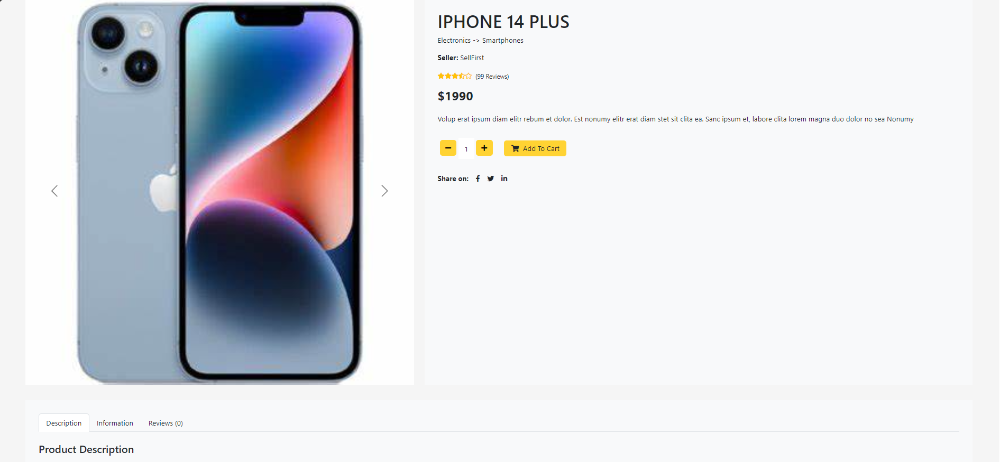
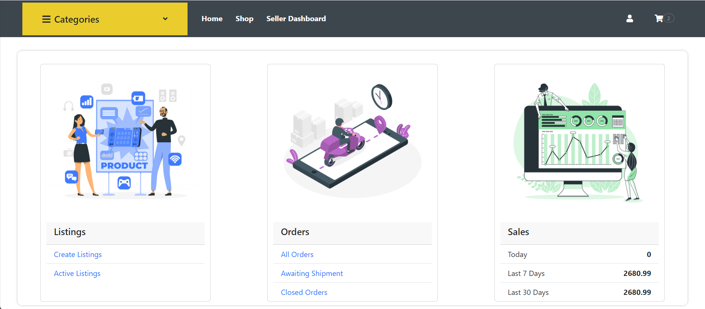

# Online Retail System Project

---

<!-- 
This is a sample image, to show how to add images to your page. To learn more options, please refer [this](https://projects.ce.pdn.ac.lk/docs/faq/how-to-add-an-image/)

 -->

## Team
-  E/19/413, Viduranga G.G.N., [email](mailto:e19413@eng.pdn.ac.lk)
-  E/19/170, K.N.N.JAYAWARDHANA, [email](mailto:e19170@eng.pdn.ac.lk)
-  E/19/349, Sandaruwan K.G.S.T, [email](mailto:e19349@eng.pdn.ac.lk)
-  E/19/193, Kaushalya N.V.K., [email](mailto:e19193@eng.pdn.ac.lk)

## Table of Contents
1. [Introduction](#introduction)
2. [Technology Stack](#technology-stack)
3. [Customer Role](#customer-role)
4. [Store Owner Role](#store-owner-role)
4. [Reomender System](#recommender-system)
2. [Links](#links)

---

## Introduction

 The Online Retail System project aims to create an e-commerce platform with customer friendly functionalities, focusing on a limited set of use cases. The project also has the potential to incorporate a recommender system to enhance the customer experience. The system will have two primary roles: Customers and Store Owners.
 

## Technology Stack

The project allows students to choose technologies they are comfortable with. Some possible technology choices could include:

- **Front-end**: HTML, CSS, JavaScript, React
- **Back-end**: Node.js
- **Database**: MySQL
- **Recommender System**: Apriori algorithm

## Customer Role

### Tasks

1. **Add Customer Details**: Customers can create accounts and provide their personal details like name, email, and shipping address.

2. **Initiate Shopping Cart**: Customers can initiate a shopping cart, which will be used to accumulate selected food items.

3. **Add Items to Shopping Cart**: Customers can browse the available food items and add them to their shopping carts.

4. **Remove Items from Shopping Cart**: Customers can remove food items from the shopping cart if they change their minds.

5. **Complete Payment**:  Customers can pay with different payment methods.

6. **View Order Details**:  Customers can access their order history, view detailed order information, track the status of current orders, and easily reorder items from their history. .

####--------------------------------------------------------------------------------------------------------------------------------------------

####--------------------------------------------------------------------------------------------------------------------------------------------

####--------------------------------------------------------------------------------------------------------------------------------------------

## Store Owner Role

####--------------------------------------------------------------------------------------------------------------------------------------------

### Tasks

1. **Add Items**: Store owners can add new food items to the system, specifying details like name, description, price, and availability.

2. **Remove Items**: Store owners can remove food items that are no longer available or relevant.

3. **Handle Customer Orders**: Store owners can manage incoming customer orders, including reviewing order details, confirming orders, and updating the order status as it progresses through stages such as processing, shipping, and delivery.

4. **View Sales Summery**: Store owners can access a sales report that displays the total sales revenue for their store on specific dates, allowing them to track their business's financial performance over time.

####--------------------------------------------------------------------------------------------------------------------------------------------

####--------------------------------------------------------------------------------------------------------------------------------------------

####--------------------------------------------------------------------------------------------------------------------------------------------

## Recommender System

Implementing a recommender system can significantly enhance the customer experience by suggesting relevant items based on their preferences and browsing history.

### Suggested Algorithm: Apriori Algorithm

The Apriori algorithm is a classic association rule mining algorithm used to discover frequent itemsets in a transactional database. It's suitable for recommendation purposes as it identifies sets of items that often appear together. Here's a simplified explanation of how the Apriori algorithm works:

1. **Frequent Itemsets Generation**: The algorithm starts by finding all individual items' frequencies in the transactional data. Items that meet a predefined support threshold are considered frequent itemsets of size 1.

2. **Combining Frequent Itemsets**: Frequent itemsets of size 1 are combined to generate candidate itemsets of size 2. These candidates are checked against the database to determine their support. Only those that meet the threshold are considered frequent.

3. **Iterative Process**: The algorithm continues this process, generating candidate itemsets of larger sizes and verifying their frequency against the database until no more frequent itemsets can be found.

4. **Association Rule Generation**: From the frequent itemsets, association rules are generated by splitting itemsets into antecedents and consequents. These rules help identify which items tend to be purchased together.

By implementing the Apriori algorithm, the recommender system can suggest complementary food items to customers based on their current selections, increasing the likelihood of upselling and enhancing the overall shopping experience.

## Links

- [Project Repository](https://github.com/cepdnaclk/e19-co227-Online-Retail-System)
- [Project Page](https://cepdnaclk.github.io/e19-co227-Online-Retail-System/)
- [Department of Computer Engineering](http://www.ce.pdn.ac.lk/)
- [University of Peradeniya](https://eng.pdn.ac.lk/)

[//]: # (Please refer this to learn more about Markdown syntax)
[//]: # (https://github.com/adam-p/markdown-here/wiki/Markdown-Cheatsheet)
